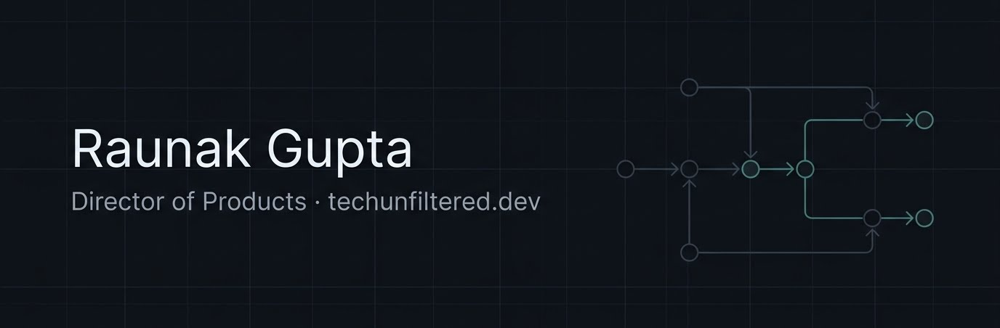

  

# Raunak Gupta

**Director of Products at CodeClouds.** 12 years building web products, cloud systems, and the teams behind them — started as a developer in 2014, been at CodeClouds since 2016 (junior → senior → team lead → PM → Director, same company).

I write about real decisions and real scars — the stuff that only shows up after you've lived with a system in production for a few years — at [**techunfiltered.dev**](https://techunfiltered.dev).

  
  
  
  

---

## What I'm building

Most of my code lives in private repos — CodeClouds products and [itoolverse](https://www.itoolverse.com) are on GitLab. The public footprint here is small and deliberate:

- [**vaaky-highlighter**](https://wordpress.org/plugins/vaaky-highlighter/) — a WordPress plugin I've quietly maintained for 10+ years
- Older experiments and abandoned packages that once solved a real problem for me

If you find something useful here, treat it as a bonus — the headline work lives elsewhere.

## What I write about

I don't write tutorials. I write about calls I had to make and still live with.

- **Architecture & infrastructure decisions** — the ones I got right, the ones I'd redo
- **Systems that look fine in theory and break at scale** — indexes, queues, rate limits, event-driven nightmares
- **Engineering leadership without losing the craft** — how I still read code, review PRs, and build tools while leading teams
- **Builder stories** — tools like itoolverse, plugins, side experiments

New posts ship every week at [techunfiltered.dev](https://techunfiltered.dev).

### Latest articles

<!-- Update this list manually until RSS is live -->
<!-- BLOG-POST-LIST:START -->

- [How I Use AI as a Manager to Save 10+ Hours Every Week](https://techunfiltered.dev/ai-for-managers-workflows-prompts)
- [VPCs, Subnets, and Routing — Explained Like a Real System, Not a Textbook](https://techunfiltered.dev/vpcs-subnets-and-routing-explained-like-a-real-system-not-a-textbook)
- [Why Your Database Indexes Are Not Working (And How to Fix Them)](https://techunfiltered.dev/why-your-database-indexes-are-not-working)
<!-- BLOG-POST-LIST:END -->

[All articles →](https://techunfiltered.dev)

---

## Stack I work with

Not a skills-list flex — just what's actually in my daily rotation at work and on side projects.

**Languages**

**Frameworks & runtime**

**Data**

**Cloud & infra**

**Dev tooling**

---

## GitHub stats

  
  

---

  
  

